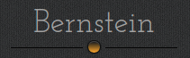
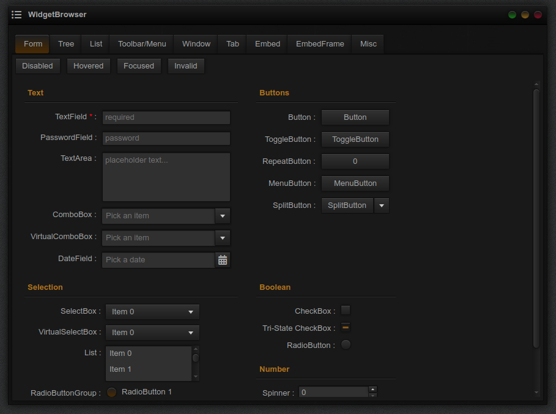

<!-- PROJECT LOGO -->
<br />
<p align="center">
  <a href="https://github.com/scro34/Bernstein">
    
  </a>

  <h3 align="center"></h3>

  <p align="center">
    A theme for the Qooxdoo JavaScript Framework
  </p>
</p>

<!-- ABOUT THE PROJECT -->
## About the &laquo;Bernstein&raquo; theme (v2.1)

<p>&laquo;Bernstein&raquo; (engl. <i>amber</i>) is a dark theme for desktop applications written in qooxdoo v3.0 or above. It has now - at long last - been adapted to qooxdoo v6.0.0 (thanks to Dmitry Zolotov, aka <a href="https://github.com/goldim" target="_blank">goldim</a>).</p>
<p>The decorators of the theme are mainly based on gradients and shadows, i. e.
only very few image files are involved, which makes it a relatively lean theme causing hardly any flicker effects.</p>

**Form Controls**


<!-- GETTING STARTED -->
## Using the Theme in your Application
To use Bernstein in your application, go to the application root directory and install the theme into your project:
```sh
$ qx package update
$ qx package list
$ qx package install goldim/Bernstein
```
Now you just have to modify your compile.json to enable the theme:
```sh
"applications": [
  {
    ...
    "theme": "bernstein.theme.Theme",
    ...
  }
],
```

## TODO list

 - Try to replace web fonts instead of standard icons and make them optional

<!-- LICENSE -->
## License

Distributed under the MIT License. See `LICENSE` file for more information.

<!-- CONTACT -->
## Contact

Norbert Schröder - [@scro34](http://scro34.de/) - email: n.schroeder@scro34.de
Dmitrii Zolotov - [@goldim](https://github.com/goldim) - email: zolotovdy@yandex.ru